# CAPSTONE PROJECT-INTRODUCTION TO CLOUD COMPUTING.

## What is cloud computing?

Cloud computing is the delivery of computing services over the internet, or "the cloud". It allows users to access computing resources like storage, servers, databases, and networking on an as-needed basis.

It offers a Pay-as-you-go pricing, faster innovation, centralised data security and so on. Some common cloud computing serves includes Email, Data analytics, Audio and Video streaming, Storage, Backups, Creating and Testing Apps.

The aim of this project emphasizes best practices in software development and deployment, including branch management through pull requests, and continuous integration/deployment strategies.

### 1. Initialize Git Repository 
I created a project directory named "Marketpeak_ecommerce", inside this directory, I initialized a Git repository using git init command to manage my version control.

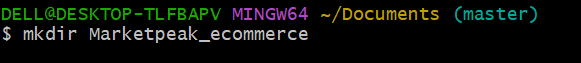
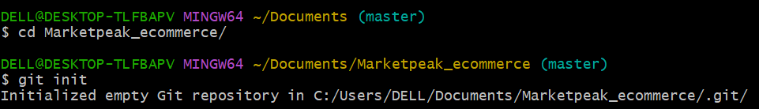

   ### 2. Obtain and prepare the E-commerce Website Template
   I downloaded a Website Template from TOOPLATE Website, then extracted the downloaded template into my project directory.
    

   I used the curl command line to download on my terminal.
   
   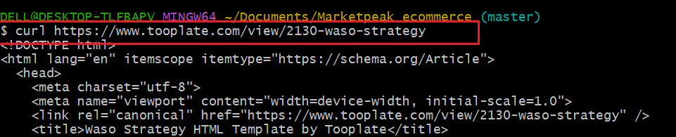
   Downloaded Website Template unzip

   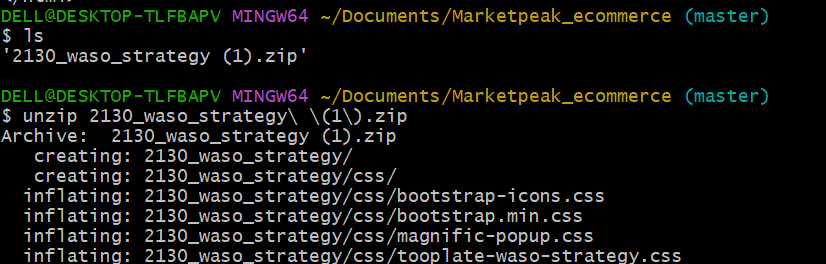

   ### 3. Stage and Commit the Template to Git

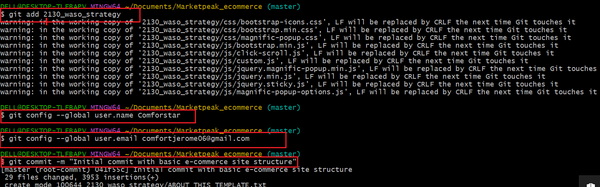

### 4. Git Push the code to Github Repository
Created a new Repository on Github account, leaving the repository empty without initialing it with README.md, gitignore or licence. Then linked my local repositotory to Github. 

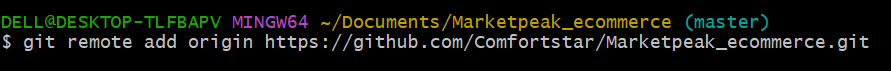

After linking the repositories, I git pushed.
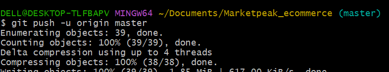

### 5. AWS Deployment
### 5.1 Set up an AWS EC2 Instance
log  into my AWS Management console, lauched an Amazon AMI Instance, set the ElasticIP and connected via SSH .

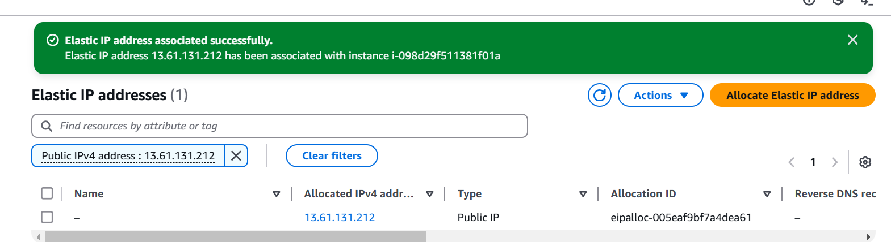
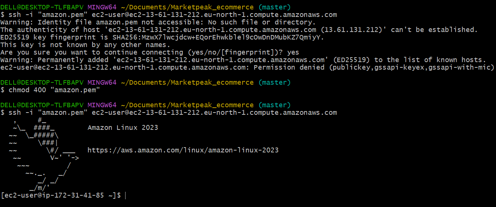

### 5.2 Clone the Repository to the Linux Server

Before cloning on the linux server, I git install on the server, the cloned the repository using url route.

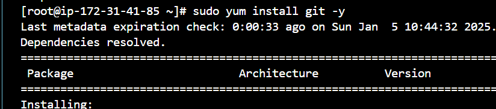
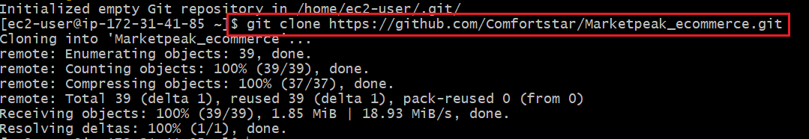

### 5.3 Install ApacheHTTPWeb Server (httpd) on EC2

Apache is a widely used web server that services HTML files and content over the internet. It is installed using YUM package manager.

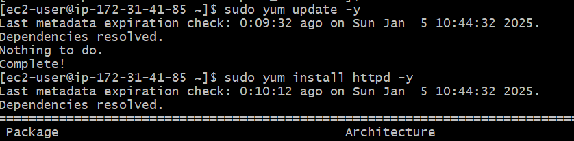
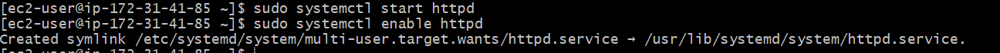
This first updates the linux server and then installs httpd, starts the web server and ensures it automatically starts on the server boot.

### 5.4 Configure httpd for Website

When apache is installed on linux, it comes with a standard dirctory known as /var/www/html. This directory 
stores webside code files. 
To serve the website from EC2 instance, configure the httpd to point to /var/www/html directory.
Clear the directory of default and copy github repository website files to it. 

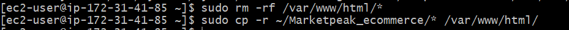
Reload httpd using;
 sudo systemctl reload httpd.

 ### 5.5 Access Website from Browser
 Platform is live after httpd configuration and website in place.
 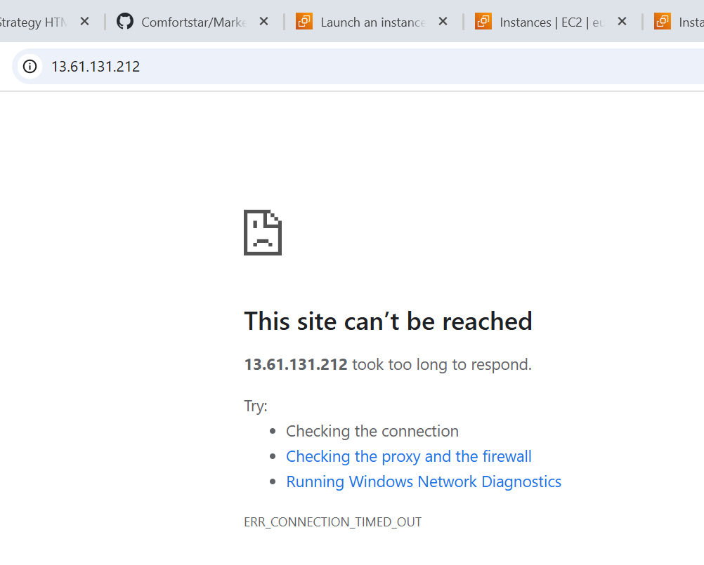
Site couldnt be reached when accessed on the server using the publicIP address.

This was overcome by editing the inbound security setting of the instance.
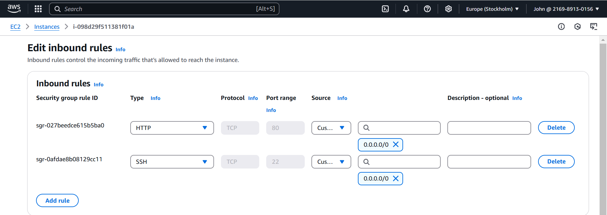
tehn I removed the "s" from the publicIP https url and test run it again.
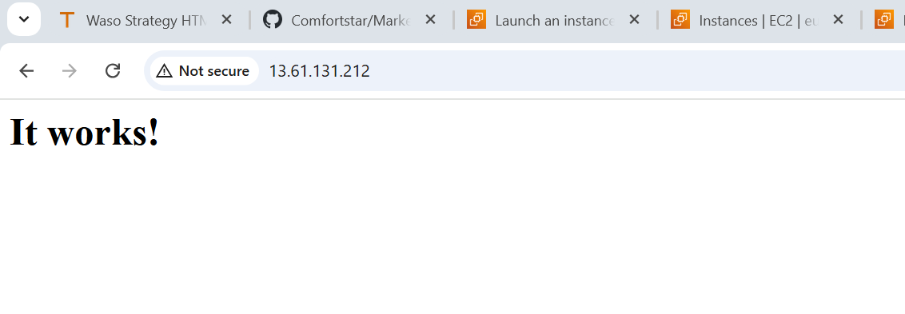

### 5.6 Continuous Integration and Deployment Workflow
I created a branch name development on the main after git pull, zipped the the website template back, then stage, commit and pushed to github.
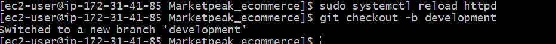
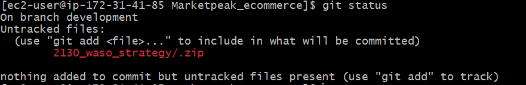
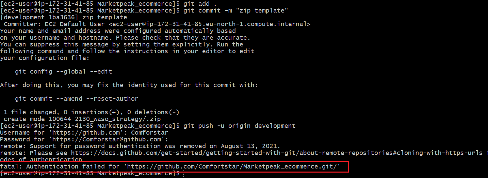
Git push was fatal, so I had to create an Access Token as a password from my github through developer setting.
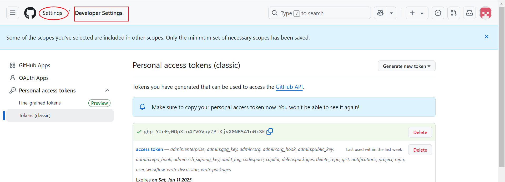

I successfully git push the branch with the access token generated.
Worked on the pull request.
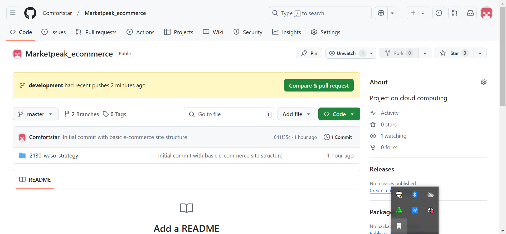
Then git merge the branch work to the main branch.
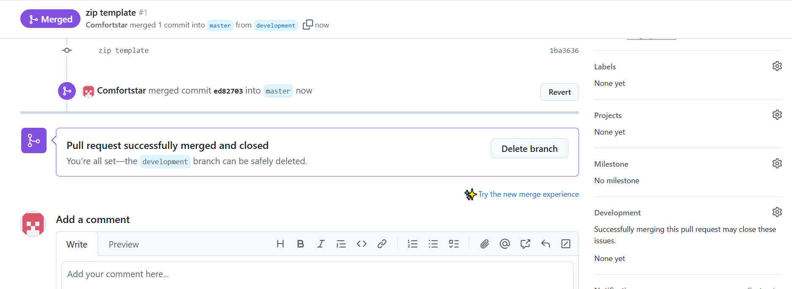
did and git pull request on my linux serve, reload the Apache and test the new changes on web server.
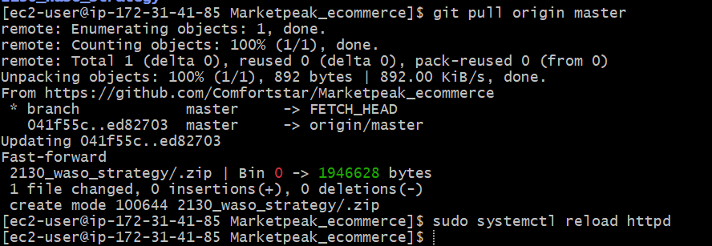

At the end of the project, I learned about continuous integration/deployment, branch management, code review through pull requests. Thank you.

